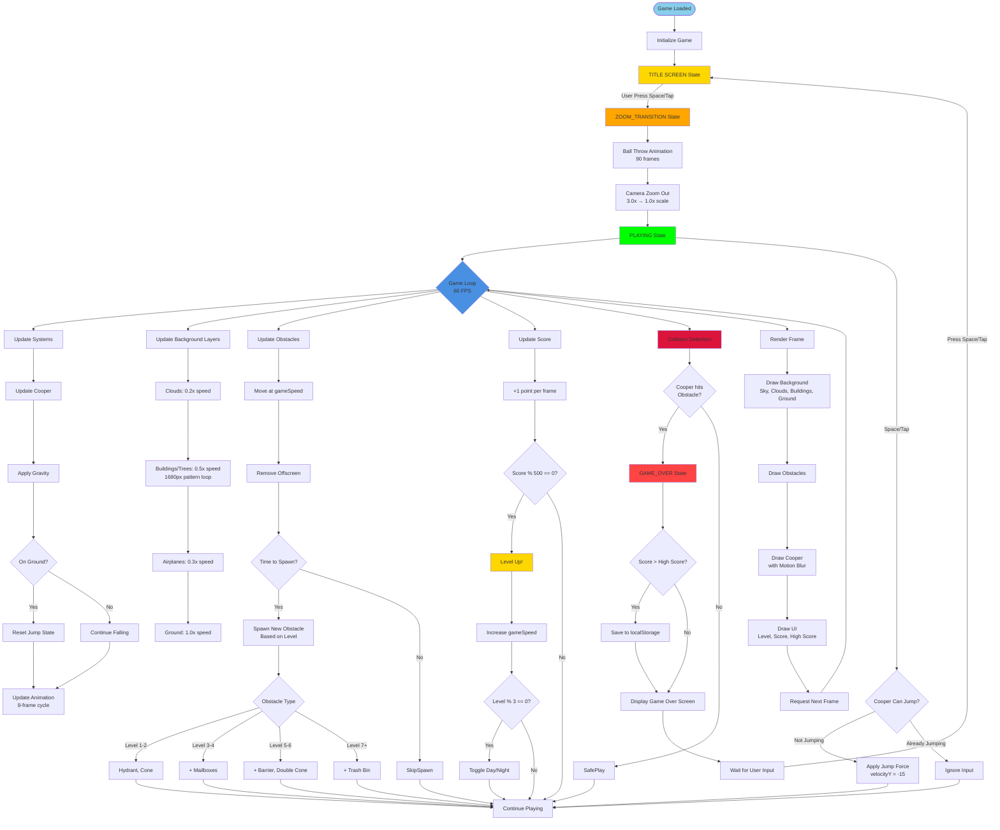
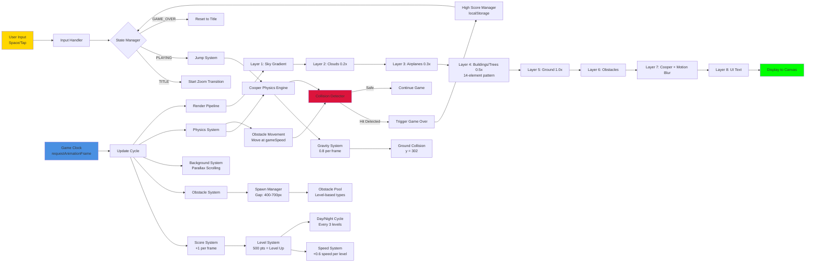
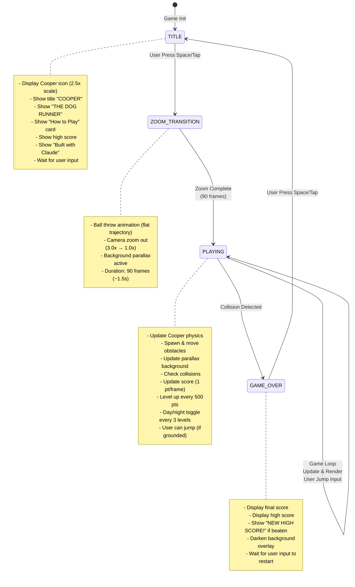

# Cooper - The Dog Runner: Workflow Diagram

## Game Flow Architecture



## System Interaction Diagram



## Data Flow Diagram

```mermaid
flowchart TD
    Config[CONFIG Constants<br/>Sizes, Speeds, Physics] --> GameState[Game State Variables<br/>score, level, gameSpeed, isDayTime]

    GameState --> Cooper[Cooper Object<br/>x, y, velocityY, isJumping, animFrame]
    GameState --> Obstacles[Obstacles Array<br/>x, y, width, height, type]
    GameState --> Background[Background Layers<br/>clouds, buildings, airplanes offsets]

    UserInput[User Input Events] --> ActionHandler{Action Handler}
    ActionHandler --> |TITLE| TransitionToZoom[Set State: ZOOM_TRANSITION<br/>Init ball animation]
    ActionHandler --> |PLAYING| JumpAction[If !isJumping: velocityY = -15]
    ActionHandler --> |GAME_OVER| ResetAction[Reset game variables<br/>Set State: TITLE]

    GameLoopTick[Game Loop Tick] --> UpdatePhase[Update Phase]
    UpdatePhase --> CooperUpdate[Cooper Update<br/>velocityY += gravity<br/>y += velocityY]
    CooperUpdate --> CooperGround{y >= groundY?}
    CooperGround --> |Yes| CooperLand[y = groundY<br/>velocityY = 0<br/>isJumping = false]
    CooperGround --> |No| CooperAir[Continue in air]

    UpdatePhase --> ObstacleUpdate[Obstacle Update<br/>x -= gameSpeed<br/>Remove if x < -width]
    ObstacleUpdate --> SpawnCheck{nextObstacleDistance <= 0?}
    SpawnCheck --> |Yes| CreateObstacle[Create new obstacle<br/>Type based on level<br/>Reset distance: 400-700]
    SpawnCheck --> |No| NoSpawn[Continue]

    UpdatePhase --> BackgroundUpdate[Background Update<br/>Offset += speed * parallaxFactor<br/>Offset %= patternLength]

    UpdatePhase --> ScoreUpdate[Score Update<br/>score += 1<br/>Check level threshold]
    ScoreUpdate --> LevelCheck{score % 500 == 0?}
    LevelCheck --> |Yes| LevelUpAction[level += 1<br/>gameSpeed += 0.6<br/>Show level up timer<br/>Toggle day/night if level % 3]
    LevelCheck --> |No| ScoreOnly[Continue scoring]

    UpdatePhase --> CollisionPhase[Collision Phase]
    CollisionPhase --> HitboxCalc[Calculate Hitboxes<br/>Cooper: +4px margin<br/>Obstacles: +2px margin]
    HitboxCalc --> BoxCollisionCheck{Box Collision?}
    BoxCollisionCheck --> |Yes| TriggerGameOver[Set State: GAME_OVER<br/>Update high score if needed]
    BoxCollisionCheck --> |No| SafeContinue[Continue game]

    GameLoopTick --> RenderPhase[Render Phase]
    RenderPhase --> ClearCanvas[Clear Canvas]
    ClearCanvas --> DrawSky[Draw Sky Gradient<br/>Day vs Night colors]
    DrawSky --> DrawClouds[Draw Clouds<br/>Based on offset]
    DrawClouds --> DrawAirplanes[Draw Airplanes + Banners<br/>"BUILT WITH CLAUDE"]
    DrawAirplanes --> DrawBuildings[Draw Buildings/Trees/Signs<br/>14-element repeating pattern<br/>Deterministic windows]
    DrawBuildings --> DrawGround[Draw Ground + Tile Lines]
    DrawGround --> DrawAllObstacles[Draw All Active Obstacles<br/>Fire hydrant, mailbox, cone, etc]
    DrawAllObstacles --> DrawCooperSprite[Draw Cooper Sprite<br/>Motion blur layers<br/>8-frame leg animation]
    DrawCooperSprite --> DrawHUD[Draw HUD<br/>Level, Score, High Score]
    DrawHUD --> CheckLevelUpTimer{levelUpTimer > 0?}
    CheckLevelUpTimer --> |Yes| DrawLevelUp[Draw "LEVEL UP!" text<br/>With fade animation]
    CheckLevelUpTimer --> |No| FrameComplete[Frame Complete]
    DrawLevelUp --> FrameComplete

    FrameComplete --> NextTick[Request Next Animation Frame]
    NextTick --> GameLoopTick

    TriggerGameOver --> HighScoreStorage[localStorage.setItem<br/>'cooperHighScore']

    style Config fill:#87CEEB
    style GameLoopTick fill:#4A90E2
    style CollisionPhase fill:#DC143C
    style LevelUpAction fill:#FFD700
    style TriggerGameOver fill:#FF4444
```

## Game State Machine



## Key Systems Overview

### 1. **Physics System**
- Gravity: 0.8 pixels/frame²
- Jump Force: -15 pixels/frame
- Ground Y: 302 pixels
- Cooper moves vertically only (horizontal is simulated by scrolling background)

### 2. **Parallax Scrolling System**
- **Clouds**: 0.2x speed, 400px loop
- **Airplanes**: 0.3x speed, random respawn
- **Buildings/Trees**: 0.5x speed, 1680px pattern (14 elements × 120px)
- **Ground**: 1.0x speed, 40px tile loop

### 3. **Obstacle System**
- Spawn gap: 400-700px (randomized)
- Level progression unlocks new obstacle types
- Types: Fire hydrant, mailbox (blue/green), cone, barrier, trash bin, double cone
- All move at `gameSpeed` (base 6 + level × 0.6)

### 4. **Scoring & Progression**
- Score: +1 point per frame (~60 pts/second)
- Level up: Every 500 points
- Speed increase: +0.6 per level
- Day/Night cycle: Every 3 levels

### 5. **Collision Detection**
- Hitbox margins: Cooper +4px, Obstacles +2px
- Simple AABB (Axis-Aligned Bounding Box) collision
- Single collision = Game Over

### 6. **Rendering Pipeline**
8 layers rendered per frame:
1. Sky gradient (day/night)
2. Clouds (parallax 0.2x)
3. Airplanes with banners (parallax 0.3x)
4. Buildings/Trees/Stop Signs/Traffic Lights (parallax 0.5x)
5. Ground with tile lines (1.0x)
6. Obstacles (foreground)
7. Cooper sprite with motion blur (foreground)
8. UI text (overlay)

---

**Game Performance**: ~200-400 draw calls per frame, targeting 60 FPS
