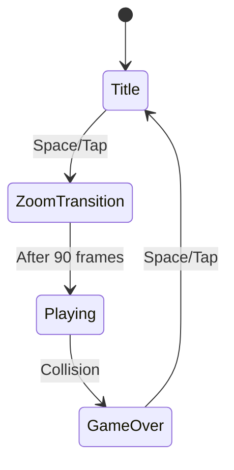
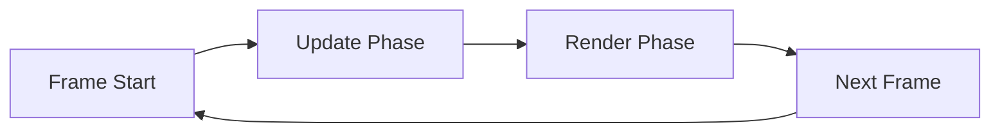
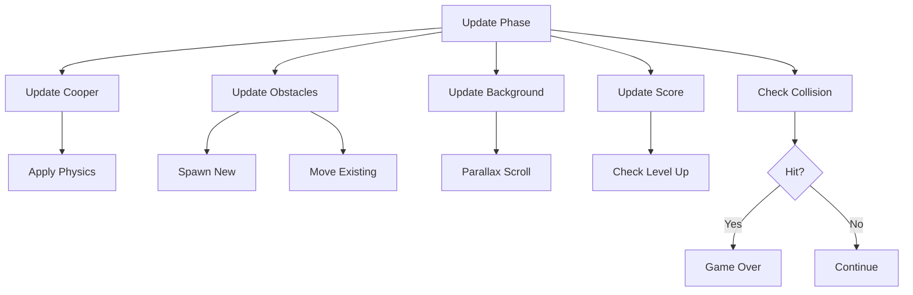
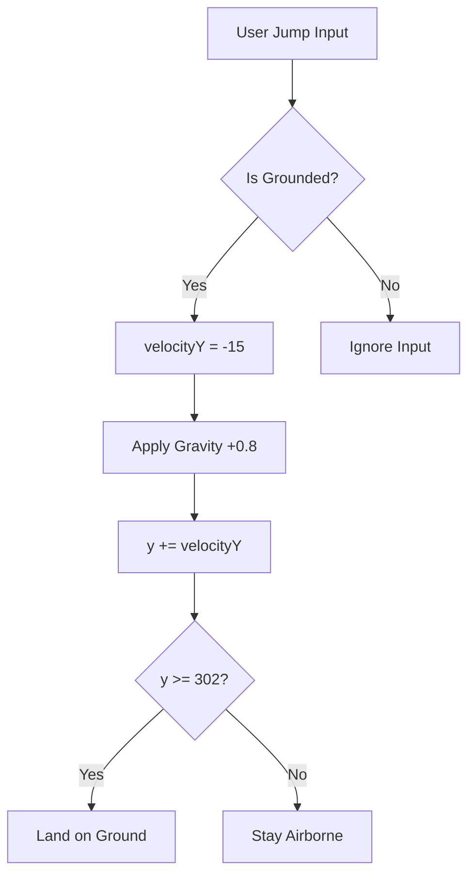
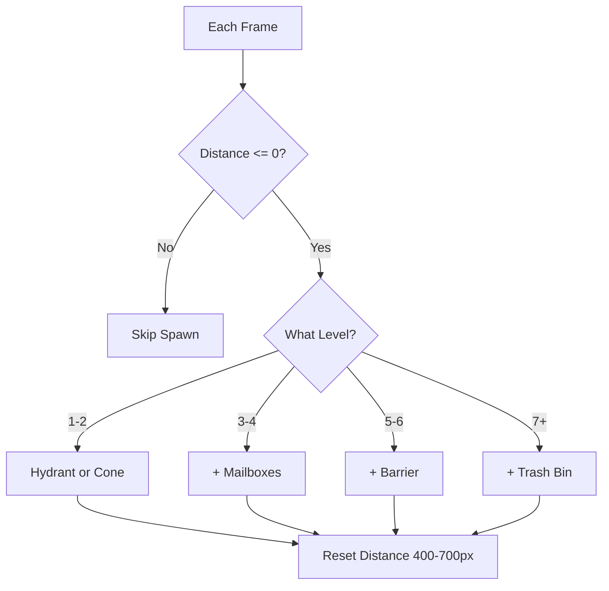
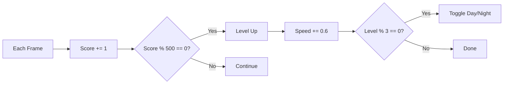
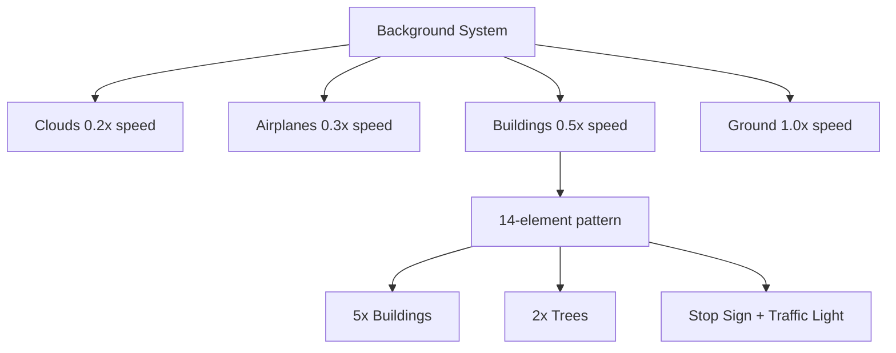
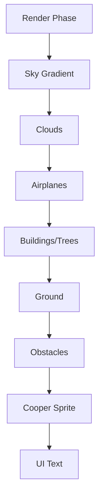

# Cooper - The Dog Runner: Workflow Documentation

## Game Architecture Overview

### Game States



### Main Game Loop (60 FPS)



### Update Phase Details



### Cooper Physics System



### Obstacle Spawning System



### Scoring & Level System



### Parallax Background Layers



### Render Pipeline



---

## Detailed System Specifications

### 1. Game States

| State | Description | User Input | Duration |
|-------|-------------|------------|----------|
| **TITLE** | Title screen with Cooper icon, "How to Play" card | Space/Tap to start | Indefinite |
| **ZOOM_TRANSITION** | Ball throw + camera zoom animation | None | 90 frames (~1.5s) |
| **PLAYING** | Active gameplay | Space/Tap to jump | Until collision |
| **GAME_OVER** | Game over screen with score | Space/Tap to restart | Indefinite |

### 2. Physics Constants

```javascript
GRAVITY = 0.8          // Pixels per frame²
JUMP_FORCE = -15       // Initial upward velocity
GROUND_Y = 302         // Ground position
BASE_SPEED = 6         // Starting game speed
SPEED_INCREASE = 0.6   // Speed added per level
```

### 3. Parallax Scrolling

| Layer | Speed Multiplier | Loop Distance | Content |
|-------|-----------------|---------------|---------|
| Clouds | 0.2x | 400px | Cloud patterns |
| Airplanes | 0.3x | Random respawn | "BUILT WITH CLAUDE" banners |
| Buildings/Trees | 0.5x | 1680px | 14-element repeating pattern |
| Ground | 1.0x | 40px | Tile lines |

### 4. Obstacle Types & Unlocks

| Level Range | Available Obstacles |
|-------------|-------------------|
| 1-2 | Fire Hydrant, Traffic Cone |
| 3-4 | + Blue Mailbox, Green Mailbox |
| 5-6 | + Street Barrier, Double Cone |
| 7+ | + Trash Bin |

**Spawn Settings:**
- Gap between obstacles: 400-700px (randomized)
- Movement speed: Matches `gameSpeed`
- Removal: When `x + width < 0`

### 5. 14-Element Background Pattern (1680px)

**First Half (0-840px):**
1. Building (80px wide, no sign)
2. Building (100px wide, CLAUDE sign)
3. **Tree** (60px wide)
4. Building (70px wide, no sign)
5. Building (120px wide, no sign)
6. **Stop Sign** (60px wide)
7. Building (90px wide, CLAUDE sign)

**Second Half (840-1680px):**
8. Building (80px wide, no sign)
9. Building (100px wide, CLAUDE sign)
10. **Tree** (60px wide)
11. Building (70px wide, no sign)
12. Building (120px wide, no sign)
13. **Traffic Light** (60px wide, green lit)
14. Building (90px wide, CLAUDE sign)

Pattern repeats seamlessly at 1680px.

### 6. Collision Detection

**Algorithm:** AABB (Axis-Aligned Bounding Box)

**Hitbox Margins:**
- Cooper: Inset 4px on all sides
- Obstacles: Inset 2px on all sides

**Collision Formula:**
```
box1.x < box2.x + box2.width AND
box1.x + box1.width > box2.x AND
box1.y < box2.y + box2.height AND
box1.y + box1.height > box2.y
```

Single collision = Immediate game over

### 7. Scoring System

- **Base Rate:** +1 point per frame (~60 points/second)
- **Level Threshold:** 500 points per level
- **Speed Scaling:** `gameSpeed = BASE_SPEED + (level - 1) × 0.6`
- **Day/Night Toggle:** Every 3 levels
- **High Score:** Stored in `localStorage`

### 8. Cooper Animation

**Sprite:** 50×50px pixel art dog facing right

**Animation States:**
- **Standing:** Neutral pose (frame 0)
- **Running:** 8-frame leg cycle (5 frames per cycle)
- **Jumping:** Ears flap based on velocity
- **Motion Blur:** 2 ghost layers at 40% and 20% opacity

**Leg Animation Cycle:**
```
Frame 0: Neutral
Frame 1-2: Front leg up
Frame 3: Transition
Frame 4: Neutral
Frame 5-6: Back leg up
Frame 7: Transition
```

### 9. Rendering Performance

**Estimated Draw Calls Per Frame:**
- Buildings/Trees: ~10-12 elements
- Windows: ~50-100 rectangles per visible building
- Obstacles: 2-5 active
- Clouds: 9-12 ellipses
- Airplanes: 1-2 with banners
- Cooper: 3 layers (motion blur)
- UI: 3-5 text elements

**Total:** ~200-400 draw calls/frame

**Target Performance:** 60 FPS on desktop, 50+ FPS on mobile

### 10. User Input Handling

| State | Input | Action |
|-------|-------|--------|
| TITLE | Space/Tap | Start zoom transition |
| ZOOM_TRANSITION | Any | Ignored |
| PLAYING | Space/Tap | Jump (if grounded) |
| GAME_OVER | Space/Tap | Return to title |

**Jump Mechanics:**
- Only works when `isJumping === false`
- Sets `velocityY = -15`
- Gravity applies every frame
- Lands when `y >= GROUND_Y`

---

## Game Flow Summary

1. **Initialization**
   - Load high score from localStorage
   - Set up canvas and event listeners
   - Generate favicons
   - Start game loop at 60 FPS

2. **Title Screen**
   - Display Cooper icon (2.5× scale)
   - Show game title and subtitle
   - Display "How to Play" card
   - Show high score (if exists)
   - Wait for user input

3. **Zoom Transition** (90 frames)
   - Tennis ball throws across screen (flat trajectory)
   - Camera zooms out from 3.0× to 1.0×
   - Background parallax active
   - Transition to playing state

4. **Playing State**
   - Update Cooper physics (gravity + jump)
   - Spawn and move obstacles
   - Scroll parallax background layers
   - Increment score every frame
   - Check for collisions
   - Level up every 500 points
   - Toggle day/night every 3 levels
   - Render all layers + UI

5. **Game Over**
   - Stop all updates
   - Display final score
   - Check and save high score
   - Show restart prompt
   - Wait for user input

---

## Technical Implementation Notes

### Day/Night Cycle

**Day Colors:**
- Sky: Light blue (#87CEEB → #B0E0E6)
- Clouds: White (#FFFFFF)
- Buildings: Gray (#4A4A4A)
- Windows: Light blue (#A8D8EA)

**Night Colors:**
- Sky: Dark blue (#0d1b2a → #1b263b)
- Clouds: Dark gray (#2d3142)
- Buildings: Very dark blue (#1a1a2e)
- Windows: Golden yellow (#FFD700) with glow

### Window Rendering Optimization

Windows use deterministic positioning based on hash:
```javascript
hash = ((wx × 7) + (wy × 13)) % 10
if (hash > 1) drawWindow() // 80% visibility
```

This prevents flickering while maintaining varied patterns.

### Favicon Generation

On game load:
- Generate 32×32 favicon (browser tab)
- Generate 180×180 Apple touch icon (mobile bookmark)
- Embed as base64 data URLs
- Use nearest-neighbor scaling for crisp pixels

---

**Built with Claude** • HTML5 Canvas Game • Single-file architecture • Pure vanilla JavaScript
